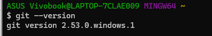
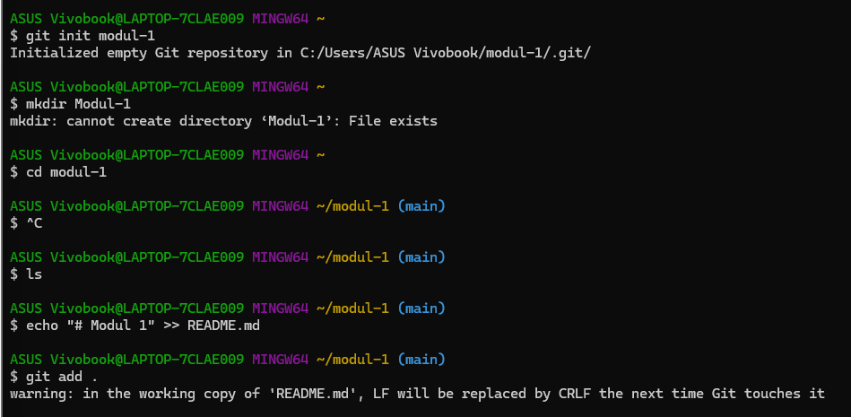
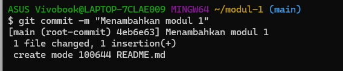
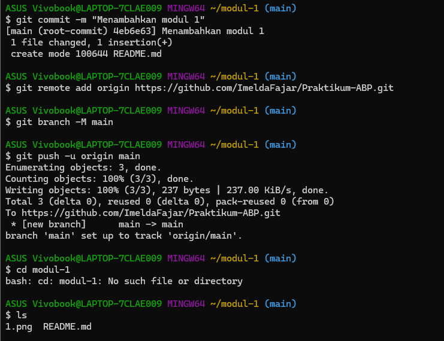
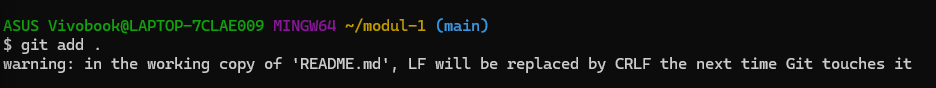
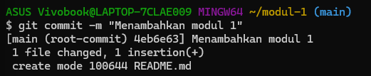
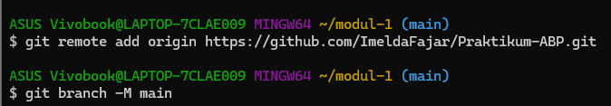

# Modul 1
<h1 align="center">LAPORAN PRAKTIKUM</h1>
<h1 align="center">APLIKASI BERBASIS PLATFORM</h1>

 

<h2 align="center">MODUL 1</h2>
<h2 align="center">GIT & GITHUB</h2>

  

   

<h2 align="center">Disusun Oleh :</h2>

  <b>Imelda Fajar</b> 
  <b>2311102004</b> 
  <b>S1 IF</b>

 

<h2 align="center">Dosen Pengampu :</h2>

  <b>Dimas Fanny Hebrasianto Permadi, S.ST., M.Kom</b>

 

<h2 align="center">Asisten Praktikum :</h2>

  <b>Apri Pandu Wicaksono</b> 
  <b>Rangga Pradarrell Fathi</b>

 

<h1 align="center">LABORATORIUM HIGH PERFORMANCE</h1>
<h1 align="center">FAKULTAS INFORMATIKA</h1>
<h1 align="center">UNIVERSITAS TELKOM PURWOKERTO</h1>
<h1 align="center">TAHUN 2026</h1>

## DASAR TEORI
Git merupakan sistem pengelolaan versi (version control system) yang digunakan untuk mencatat dan melacak perubahan pada file dalam suatu proyek. Dengan Git, pengguna dapat melihat riwayat perubahan, membandingkan versi, serta mengembalikan file ke kondisi sebelumnya. Git juga bersifat terdistribusi, sehingga setiap pengguna memiliki salinan repository di komputernya.

Dalam penggunaannya, Git memiliki tahapan seperti working directory, staging area, dan repository. Perubahan disimpan melalui proses add dan commit. Selain itu, Git dapat terhubung dengan layanan seperti GitHub untuk menyimpan project secara online dan memudahkan kolaborasi.

---

## LANGKAH-LANGKAH SET-UP REPOSITORY VIA CLI

### 1. Mengecek Instalasi Git
Langkah pertama yang dilakukan adalah memastikan Git sudah terinstall dengan menjalankan perintah:
`git --version`

Perintah ini menampilkan versi Git yang terpasang pada komputer.

---

### 2. Konfigurasi Git
Selanjutnya dilakukan konfigurasi username dan email menggunakan perintah:
`git config --global user.name "Imelda Fajar"`  
`git config --global user.email "2311102004@ittelkom-pwt.ac.id"`

Konfigurasi ini bertujuan agar setiap commit memiliki identitas pengguna.

---

### 3. Membuat Repository Lokal
Repository lokal dibuat menggunakan perintah:
`git init modul-1`

Kemudian masuk ke folder repository:
`cd modul-1`

Langkah ini bertujuan untuk membuat folder project sekaligus mengaktifkan Git di dalamnya.

---

### 4. Membuat File README
Selanjutnya dibuat file README sebagai dokumentasi menggunakan perintah:
`echo "# Modul 1" >> README.md`

File ini akan digunakan untuk menjelaskan isi project di GitHub.

---

### 5. Menambahkan File ke Staging Area
File yang sudah dibuat ditambahkan ke staging area dengan perintah:
`git add .`

Perintah ini berfungsi untuk menandai file yang akan disimpan ke repository.

---

### 6. Melakukan Commit
Setelah file ditambahkan, langkah berikutnya adalah melakukan commit:
`git commit -m "Menambahkan modul 1"`

Commit digunakan untuk menyimpan perubahan yang telah dilakukan.

---

### 7. Menghubungkan ke Repository GitHub
Repository lokal kemudian dihubungkan dengan repository GitHub menggunakan perintah:
`git remote add origin https://github.com/username/Praktikum-ABP.git`

Langkah ini bertujuan agar project lokal dapat terhubung dengan repository online.

---

### 8. Melakukan Push ke GitHub
Langkah terakhir adalah mengirim file ke GitHub menggunakan perintah:
`git push -u origin main`

Setelah proses ini berhasil, file dan folder akan muncul di repository GitHub.

---

## Kesimpulan
Berdasarkan praktikum yang telah dilakukan, dapat disimpulkan bahwa penggunaan Git dan GitHub sangat membantu dalam mengelola project. Git digunakan untuk mengatur perubahan file secara lokal melalui proses add dan commit, sedangkan GitHub digunakan untuk menyimpan project secara online melalui proses push. Dengan demikian, project dapat dikelola dengan lebih terstruktur dan mudah diakses.

---

## Watermark
**Imelda Fajar - 2311102004**
