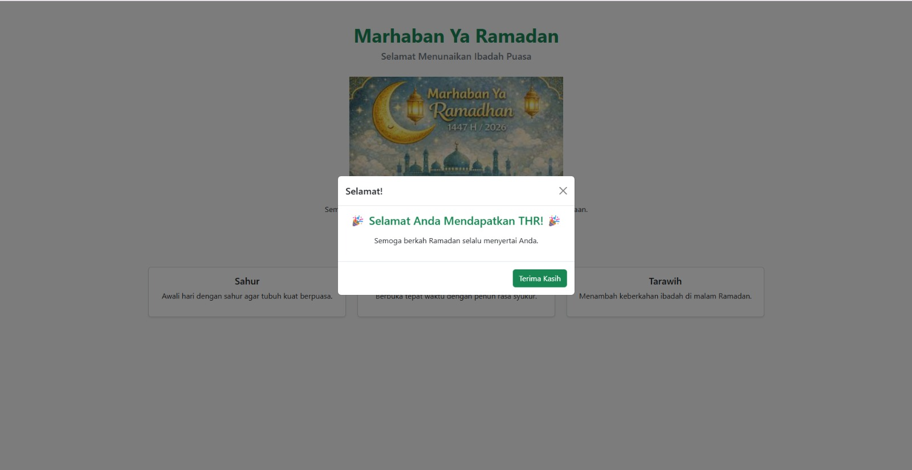

<h1 align="center">LAPORAN PRAKTIKUM</h1>
<h1 align="center">APLIKASI BERBASIS PLATFORM</h1>

<br>

<h2 align="center">MODUL 5</h2>
<h2 align="center">JAVASCRIPT & JQUERY</h2>

<br><br>

<p align="center">

</p>
<br><br><br>

<h2 align="center">Disusun Oleh :</h2>

<p align="center" style="font-size:28px;">
  <b>Imelda Fajar Awalina Crisyanti</b><br>
  <b>2311102004</b><br>
  <b>S1 IF-11-REG 01</b>
</p>
<br>
<h2 align="center">Dosen Pengampu :</h2>

<p align="center" style="font-size:28px;">
  <b>Dimas Fanny Hebrasianto Permadi, S.ST., M.Kom</b>
</p>
<br>
<h2 align="center">Asisten Praktikum :</h2>

<p align="center" style="font-size:28px;">
  <b>Apri Pandu Wicaksono</b><br>
  <b>Rangga Pradarrell Fathi</b>
</p>
<br>
<h1 align="center">LABORATORIUM HIGH PERFORMANCE</h1>
<h1 align="center">FAKULTAS INFORMATIKA</h1>
<h1 align="center">UNIVERSITAS TELKOM PURWOKERTO</h1>
<h1 align="center">TAHUN 2026</h1>

<hr>

### Dasar Teori
1. Konsep JavaScript dalam Pengembangan Web

JavaScript merupakan bahasa pemrograman yang berjalan pada sisi klien (client-side) di dalam browser. Bahasa ini digunakan untuk meningkatkan kemampuan halaman web agar tidak hanya menampilkan informasi, tetapi juga dapat melakukan interaksi secara langsung dengan pengguna. Dengan JavaScript, elemen HTML dapat dimodifikasi secara dinamis tanpa perlu memuat ulang halaman.

Dalam implementasinya, JavaScript digunakan untuk menangani berbagai aktivitas pengguna seperti klik tombol, pengisian form, hingga perubahan tampilan elemen secara real-time. Hal ini membuat pengalaman pengguna menjadi lebih responsif dan interaktif.

JavaScript juga memiliki struktur pemrograman yang fleksibel karena mendukung beberapa konsep seperti variabel untuk menyimpan data, fungsi untuk mengorganisasi logika program, serta kontrol alur seperti kondisi dan perulangan. Selain itu, JavaScript memiliki berbagai tipe data yang digunakan untuk mengelola informasi seperti angka, teks, nilai logika, serta struktur data kompleks seperti objek dan array.

2. Peran jQuery dalam Pengembangan Aplikasi Web

jQuery merupakan pustaka (library) JavaScript yang dirancang untuk menyederhanakan proses manipulasi elemen HTML dan penanganan event pada halaman web. Library ini membantu pengembang dalam menulis kode yang lebih ringkas dibandingkan JavaScript murni, sehingga proses pengembangan menjadi lebih efisien.

Dengan jQuery, berbagai fungsi seperti perubahan struktur DOM, animasi elemen, serta komunikasi data melalui AJAX dapat dilakukan dengan lebih mudah dan cepat. Selain itu, jQuery juga membantu mengurangi kompleksitas kode dalam menangani perbedaan perilaku browser.

Penggunaan jQuery dapat dilakukan melalui file lokal maupun melalui CDN (Content Delivery Network) sehingga lebih fleksibel dalam implementasi proyek web.

3. Implementasi Interaksi Web Menggunakan Bootstrap Modal

Dalam praktikum ini, konsep interaksi web tidak hanya menggunakan JavaScript dasar, tetapi juga memanfaatkan komponen Bootstrap. Salah satu fitur yang digunakan adalah modal, yaitu jendela pop-up yang muncul ketika pengguna melakukan aksi tertentu seperti menekan tombol.

Bootstrap modal bekerja dengan memanfaatkan JavaScript bawaan framework untuk mengatur tampilan elemen secara dinamis. Komponen ini memudahkan pengembang dalam membuat interaksi tanpa perlu menulis kode JavaScript yang kompleks secara manual. Dengan demikian, pengembangan antarmuka menjadi lebih cepat, konsisten, dan responsif di berbagai perangkat.


### Source Code
```
<!DOCTYPE html>
<html lang="id">
<head>
<meta charset="UTF-8">
<meta name="viewport" content="width=device-width, initial-scale=1.0">
<title>THR Ramadhan</title>

<!-- Bootstrap CSS -->
<link href="https://cdn.jsdelivr.net/npm/bootstrap@5.3.3/dist/css/bootstrap.min.css" rel="stylesheet">
</head>

<body class="bg-light">

<!-- HEADER -->
<div class="container text-center mt-5">

<h1 class="text-success fw-bold">Marhaban Ya Ramadan</h1>
<h5 class="text-secondary">Selamat Menunaikan Ibadah Puasa</h5>


<p class="mt-3">
Semoga bulan Ramadan membawa keberkahan, kedamaian, dan kebahagiaan.
</p>

<!-- BUTTON TRIGGER MODAL -->
<button class="btn btn-warning mt-2"
        data-bs-toggle="modal"
        data-bs-target="#thrModal">
🎁 Ambil THR
</button>

</div>

<!-- CARD SECTION -->
<div class="container mt-5">
<div class="row text-center">

<div class="col-md-4">
<div class="card shadow-sm">
<div class="card-body">
<h5>Sahur</h5>
<p>Awali hari dengan sahur agar tubuh kuat berpuasa.</p>
</div>
</div>
</div>

<div class="col-md-4">
<div class="card shadow-sm">
<div class="card-body">
<h5>Berbuka</h5>
<p>Berbuka tepat waktu dengan penuh rasa syukur.</p>
</div>
</div>
</div>

<div class="col-md-4">
<div class="card shadow-sm">
<div class="card-body">
<h5>Tarawih</h5>
<p>Menambah keberkahan ibadah di malam Ramadan.</p>
</div>
</div>
</div>

</div>
</div>

<!-- MODAL POPUP THR -->
<div class="modal fade" id="thrModal" tabindex="-1">

<div class="modal-dialog modal-dialog-centered">

<div class="modal-content">

<div class="modal-header">
<h5 class="modal-title">Selamat!</h5>
<button type="button" class="btn-close" data-bs-dismiss="modal"></button>
</div>

<div class="modal-body text-center">

<h4 class="text-success">
🎉 Selamat Anda Mendapatkan THR! 🎉
</h4>

<p class="mt-3">
Semoga berkah Ramadan selalu menyertai Anda.
</p>

</div>

<div class="modal-footer">
<button class="btn btn-success" data-bs-dismiss="modal">
Terima Kasih
</button>
</div>

</div>
</div>
</div>

<!-- BOOTSTRAP JS (WAJIB UNTUK MODAL) -->
<script src="https://cdn.jsdelivr.net/npm/bootstrap@5.3.3/dist/js/bootstrap.bundle.min.js"></script>

</body>
</html>


```
### Output 



### Penjelasan Kode Program
Program tersebut merupakan halaman web berbasis HTML yang memanfaatkan framework Bootstrap untuk membangun tampilan yang responsif dan interaktif. Struktur utama dimulai dari deklarasi dokumen HTML5 yang diikuti dengan pengaturan bahasa Indonesia serta konfigurasi meta viewport agar halaman dapat menyesuaikan ukuran layar perangkat. Pada bagian head, halaman ini menghubungkan Bootstrap melalui CDN sehingga seluruh komponen seperti grid, tombol, card, dan modal dapat digunakan tanpa perlu instalasi tambahan.

Pada bagian body, halaman menggunakan container Bootstrap untuk mengatur tata letak konten agar berada di tengah dan terlihat rapi. Bagian header menampilkan judul utama “Marhaban Ya Ramadan”, subjudul, gambar ilustrasi, serta teks deskripsi singkat yang memberikan konteks tema Ramadan. Di bawahnya terdapat tombol interaktif “Ambil THR” yang berfungsi sebagai pemicu modal menggunakan atribut data-bs-toggle dan data-bs-target yang terhubung dengan elemen modal.

Selanjutnya, terdapat section card yang disusun menggunakan sistem grid Bootstrap dengan tiga kolom utama. Setiap kolom berisi informasi terkait aktivitas Ramadan yaitu sahur, berbuka, dan tarawih. Komponen card digunakan untuk menampilkan informasi secara terstruktur dan mudah dibaca oleh pengguna.

Bagian terakhir adalah modal Bootstrap yang berfungsi sebagai pop-up ketika tombol ditekan. Modal ini terdiri dari header, body, dan footer yang menampilkan pesan selamat serta tombol untuk menutup modal. Fungsi modal dijalankan menggunakan Bootstrap JavaScript bundle yang diintegrasikan di bagian akhir kode. Dengan adanya script ini, seluruh komponen interaktif seperti modal dapat berjalan dengan baik di browser.

### Kesimpulan
Berdasarkan implementasi program halaman web “THR Ramadhan” menggunakan HTML dan Bootstrap, dapat disimpulkan bahwa teknologi web modern memungkinkan pembuatan tampilan antarmuka yang menarik, rapi, dan responsif dengan struktur kode yang relatif sederhana. Penggunaan Bootstrap membantu mempercepat proses pengembangan karena menyediakan komponen siap pakai seperti grid, card, tombol, dan modal tanpa perlu membuat desain dari nol.

Selain itu, interaksi pada halaman web dapat berjalan dengan baik melalui pemanfaatan fitur JavaScript bawaan Bootstrap, khususnya pada komponen modal. Fitur ini memungkinkan pengguna berinteraksi secara langsung dengan halaman melalui aksi klik tombol yang kemudian memunculkan pop-up informasi. Hal ini menunjukkan bahwa integrasi antara HTML, CSS framework, dan JavaScript mampu menghasilkan pengalaman pengguna yang lebih dinamis.

Secara keseluruhan, praktikum ini memberikan pemahaman bahwa pengembangan web tidak hanya berfokus pada tampilan visual, tetapi juga pada aspek interaktivitas dan struktur kode yang efisien. Dengan penerapan Bootstrap, proses pembuatan halaman web menjadi lebih cepat, konsisten, dan mudah dikembangkan lebih lanjut sesuai kebutuhan.
