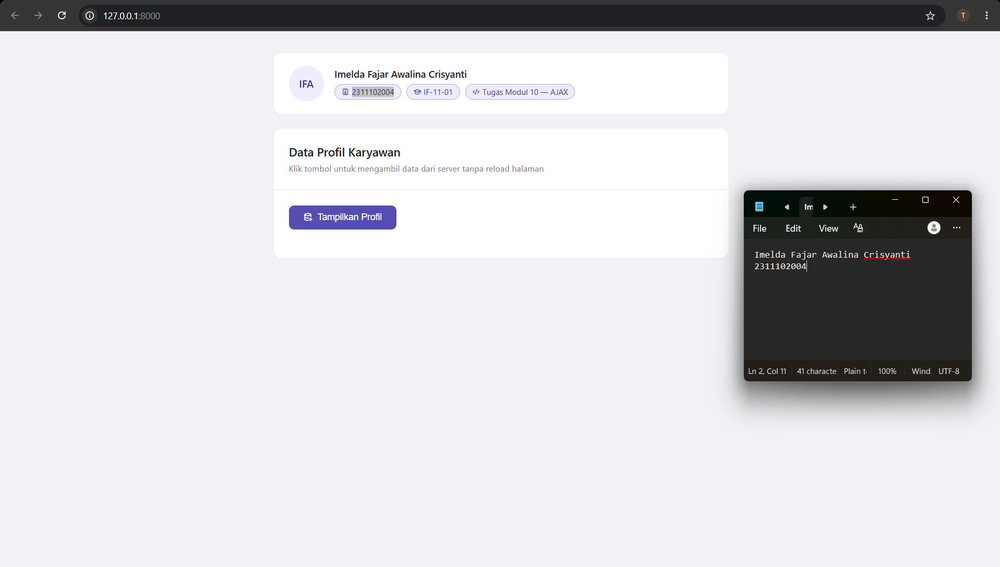

<div align="center">
    <br />
    <h1>LAPORAN PRAKTIKUM <br> APLIKASI BERBASIS PLATFORM </h1>
    <br />
    <h3>MODUL 10 <br> AJAX </h3>
    <br />
    
    <br />
    <br />
    <br />
    <h3>Disusun Oleh :</h3>
    <p>
        <strong>Imelda Fajar Awalina Crisyanti</strong>
        <br>
        <strong>2311102004</strong>
        <br>
        <strong>S1 IF-11-01</strong>
    </p>
    <br />
    <h3>Dosen Pengampu :</h3>
    <p>
        <strong>Dimas Fanny Hebrasianto Permadi, S.ST., M.Kom</strong>
    </p>
    <br />
    <br />
    <h4>Asisten Praktikum :</h4>
    <strong>Apri Pandu Wicaksono</strong>
    <br>
    <strong>Rangga Pradarrel fathi</strong>
    <br />
    <h3>LABORATORIUM HIGH PERFORMANCE <br>FAKULTAS INFORMATIKA <br>UNIVERSITAS TELKOM PURWOKERTO <br>2026 </h3>
</div>
<hr>

## Dasar Teori

AJAX (Asynchronous JavaScript and XML) adalah teknik pemrograman web yang memungkinkan halaman web untuk berkomunikasi dengan server secara asinkron di latar belakang, tanpa harus memuat ulang keseluruhan halaman. Istilah ini pertama kali diperkenalkan oleh Jesse James Garrett pada tahun 2005, meskipun teknologi-teknologi penyusunnya seperti XMLHttpRequest telah ada sebelumnya. Tujuan utama AJAX adalah menciptakan pengalaman pengguna yang lebih responsif dan interaktif, karena hanya sebagian kecil konten halaman yang diperbarui saat terjadi interaksi — seperti mengirim formulir, memuat data tambahan, atau melakukan validasi input secara langsung — tanpa mengganggu tampilan halaman secara keseluruhan.

Secara teknis, AJAX menggabungkan beberapa teknologi sekaligus: JavaScript sebagai pengendali logika dan event, XMLHttpRequest atau Fetch API modern sebagai objek perantara yang mengirim dan menerima permintaan HTTP ke server, serta format data seperti XML, JSON, atau teks biasa untuk pertukaran informasi antara klien dan server. Meskipun namanya mengandung kata XML, saat ini JSON (JavaScript Object Notation) jauh lebih sering digunakan karena lebih ringan, mudah dibaca, dan bersifat native terhadap JavaScript. Alur kerja AJAX secara sederhana: pengguna memicu event (misalnya klik tombol) → JavaScript membuat objek permintaan → mengirim permintaan HTTP ke server → server memproses dan mengembalikan respons → JavaScript menangkap respons lalu memperbarui elemen HTML tertentu tanpa mengganggu tampilan halaman lainnya.

Implementasi AJAX dapat ditemukan pada berbagai aplikasi web modern, seperti Google Maps yang memuat peta secara dinamis, YouTube yang memuat komentar tanpa refresh, Gmail dengan pengiriman email asinkron, serta sistem dashboard real-time dan form validasi yang umum digunakan dalam pengembangan website. Dalam konteks praktikum ini, AJAX diwujudkan melalui Fetch API untuk mengambil data profil dari server — yang pada implementasi berbasis Laravel dikemas dalam sebuah route `/data` yang mengembalikan response JSON — ketika tombol ditekan, lalu menampilkan hasilnya secara dinamis tanpa me-refresh halaman. Inilah inti dari pengalaman web yang mulus dan efisien dalam pendekatan modern berbasis framework.

## Tugas Modul 10 - AJAX

### Source Code

**1. Controller (ProfilController.php)**

File ini berfungsi sebagai pengganti `data.php` pada PHP biasa. Method `getData()` mengembalikan data array profil dalam format JSON menggunakan `response()->json()` yang secara otomatis menambahkan header `Content-Type: application/json`.

```php
<?php

namespace App\Http\Controllers;

use Illuminate\Http\Request;

class ProfilController extends Controller
{
    // Menampilkan halaman utama
    public function index()
    {
        return view('index');
    }

    // Pengganti data.php — mengembalikan data JSON
    public function getData()
    {
        $data = [
            ['nama' => 'Budi',   'pekerjaan' => 'Web Developer',   'lokasi' => 'Jakarta'],
            ['nama' => 'Sari',   'pekerjaan' => 'UI/UX Designer',  'lokasi' => 'Bandung'],
            ['nama' => 'Doni',   'pekerjaan' => 'Data Analyst',    'lokasi' => 'Surabaya'],
            ['nama' => 'Rina',   'pekerjaan' => 'Backend Engineer','lokasi' => 'Yogyakarta'],
            ['nama' => 'Farhan', 'pekerjaan' => 'DevOps Engineer', 'lokasi' => 'Medan'],
        ];

        return response()->json($data);
    }
}
```

**2. Routes (web.php)**

Mendaftarkan dua route: satu untuk menampilkan halaman utama dan satu sebagai endpoint AJAX pengganti `data.php`.

```php
<?php

use Illuminate\Support\Facades\Route;
use App\Http\Controllers\ProfilController;

Route::get('/', [ProfilController::class, 'index']);
Route::get('/data', [ProfilController::class, 'getData']);
```

**3. View (index.blade.php)**

Halaman utama yang menampilkan kartu identitas mahasiswa, tombol "Tampilkan Profil", dan area hasil data yang diisi secara dinamis melalui AJAX menggunakan Fetch API.

```html
<!DOCTYPE html>
<html lang="id">
<head>
    <meta charset="UTF-8">
    <meta name="viewport" content="width=device-width, initial-scale=1.0">
    <title>Tugas Modul 10 - AJAX Laravel</title>
    <link rel="stylesheet" href="https://cdn.jsdelivr.net/npm/@tabler/icons-webfont@latest/dist/tabler-icons.min.css">
    <style>
        * { margin: 0; padding: 0; box-sizing: border-box; }

        body {
            font-family: 'Segoe UI', Tahoma, Geneva, Verdana, sans-serif;
            background: #f0f2f5;
            min-height: 100vh;
            padding: 2rem 1rem;
        }

        .page-wrap {
            max-width: 700px;
            margin: 0 auto;
            display: flex;
            flex-direction: column;
            gap: 1.25rem;
        }

        .id-card {
            background: #fff;
            border: 1px solid #e2e8f0;
            border-radius: 14px;
            padding: 1.25rem 1.5rem;
            display: flex;
            align-items: center;
            gap: 1rem;
        }

        .avatar {
            width: 54px; height: 54px;
            border-radius: 50%;
            background: #EEEDFE;
            display: flex; align-items: center; justify-content: center;
            font-size: 16px; font-weight: 600; color: #3C3489;
            flex-shrink: 0;
        }

        .id-info h2 { font-size: 15px; font-weight: 600; color: #1a202c; margin-bottom: 6px; }
        .id-meta { display: flex; gap: 8px; flex-wrap: wrap; }

        .badge {
            font-size: 12px; padding: 3px 10px;
            border-radius: 20px;
            background: #EEEDFE; color: #3C3489;
            border: 1px solid #AFA9EC;
            display: inline-flex; align-items: center; gap: 4px;
        }

        .main-card {
            background: #fff;
            border: 1px solid #e2e8f0;
            border-radius: 14px;
            overflow: hidden;
        }

        .card-header { padding: 1.5rem; border-bottom: 1px solid #e2e8f0; }
        .card-header h1 { font-size: 18px; font-weight: 600; color: #1a202c; margin-bottom: 4px; }
        .card-header p { font-size: 13px; color: #718096; }
        .card-body { padding: 1.5rem; }

        .btn-primary {
            display: inline-flex; align-items: center; gap: 8px;
            background: #534AB7; color: #fff;
            border: none; padding: 10px 22px;
            border-radius: 8px; font-size: 14px;
            cursor: pointer; transition: background .18s, transform .1s;
        }
        .btn-primary:hover { background: #3C3489; }
        .btn-primary:active { transform: scale(0.98); }
        .btn-primary:disabled { background: #a0aec0; cursor: not-allowed; }

        .status-row {
            margin-top: 1rem; font-size: 13px; color: #718096;
            display: none; align-items: center; gap: 8px;
        }

        .spinner {
            width: 14px; height: 14px;
            border: 2px solid #AFA9EC;
            border-top-color: #534AB7;
            border-radius: 50%;
            animation: spin .7s linear infinite;
        }
        @keyframes spin { to { transform: rotate(360deg); } }

        .results { display: flex; flex-direction: column; gap: 10px; margin-top: 1.25rem; }

        .profil-card {
            background: #f7fafc;
            border: 1px solid #e2e8f0;
            border-radius: 10px;
            padding: 1rem 1.25rem;
            display: flex; align-items: center; gap: 1rem;
            animation: fadeUp .28s ease both;
        }
        @keyframes fadeUp {
            from { opacity: 0; transform: translateY(8px); }
            to   { opacity: 1; transform: translateY(0); }
        }

        .profil-avatar {
            width: 40px; height: 40px;
            border-radius: 50%;
            background: #E1F5EE;
            display: flex; align-items: center; justify-content: center;
            font-size: 13px; font-weight: 600; color: #085041;
            flex-shrink: 0;
        }

        .profil-name { font-size: 14px; font-weight: 600; color: #1a202c; margin-bottom: 4px; }
        .profil-meta { display: flex; gap: 8px; flex-wrap: wrap; }

        .meta-chip {
            font-size: 12px; padding: 2px 9px;
            border-radius: 20px;
            border: 1px solid #e2e8f0;
            color: #4a5568;
            display: inline-flex; align-items: center; gap: 4px;
        }

        .error-box {
            background: #fff5f5; border: 1px solid #fed7d7;
            border-radius: 8px; padding: .875rem 1rem;
            font-size: 13px; color: #c53030;
            display: none; margin-top: 1rem;
        }
    </style>
</head>
<body>

<div class="page-wrap">

    {{-- Kartu Identitas Mahasiswa --}}
    <div class="id-card">
        <div class="avatar">IFA</div>
        <div class="id-info">
            <h2>Imelda Fajar Awalina Crisyanti</h2>
            <div class="id-meta">
                <span class="badge"><i class="ti ti-id-badge"></i> 2311102004</span>
                <span class="badge"><i class="ti ti-school"></i> IF-11-01</span>
                <span class="badge"><i class="ti ti-code"></i> Tugas Modul 10 — AJAX</span>
            </div>
        </div>
    </div>

    {{-- Kartu Utama --}}
    <div class="main-card">
        <div class="card-header">
            <h1>Data Profil Karyawan</h1>
            <p>Klik tombol untuk mengambil data dari server tanpa reload halaman</p>
        </div>
        <div class="card-body">
            <button class="btn-primary" id="btn-tampilkan">
                <i class="ti ti-database-import"></i> Tampilkan Profil
            </button>

            <div class="status-row" id="loading">
                <div class="spinner"></div>
                <span>Mengambil data dari server...</span>
            </div>

            <div class="error-box" id="pesan-error"></div>
            <div class="results" id="hasil-profil"></div>
        </div>
    </div>

</div>

<script>
    function getInitials(nama) {
        return nama.split(' ').map(w => w[0]).join('').slice(0, 2).toUpperCase();
    }

    const btn        = document.getElementById('btn-tampilkan');
    const hasil      = document.getElementById('hasil-profil');
    const loading    = document.getElementById('loading');
    const pesanError = document.getElementById('pesan-error');

    btn.addEventListener('click', function () {
        hasil.innerHTML          = '';
        pesanError.style.display = 'none';
        loading.style.display    = 'flex';
        btn.disabled             = true;
        btn.innerHTML            = '<i class="ti ti-loader"></i> Memuat...';

        fetch('/data')
            .then(res => {
                if (!res.ok) throw new Error('Gagal mengambil data dari server.');
                return res.json();
            })
            .then(data => {
                loading.style.display = 'none';

                data.forEach((profil, i) => {
                    const card = document.createElement('div');
                    card.className = 'profil-card';
                    card.style.animationDelay = (i * 60) + 'ms';
                    card.innerHTML = `
                        <div class="profil-avatar">${getInitials(profil.nama)}</div>
                        <div>
                            <div class="profil-name">${profil.nama}</div>
                            <div class="profil-meta">
                                <span class="meta-chip"><i class="ti ti-briefcase"></i>${profil.pekerjaan}</span>
                                <span class="meta-chip"><i class="ti ti-map-pin"></i>${profil.lokasi}</span>
                            </div>
                        </div>
                    `;
                    hasil.appendChild(card);
                });

                btn.disabled  = false;
                btn.innerHTML = '<i class="ti ti-refresh"></i> Muat Ulang';
            })
            .catch(err => {
                loading.style.display    = 'none';
                pesanError.style.display = 'block';
                pesanError.innerHTML     = `<i class="ti ti-alert-circle"></i> ${err.message}`;
                btn.disabled             = false;
                btn.innerHTML            = '<i class="ti ti-database-import"></i> Tampilkan Profil';
            });
    });
</script>

</body>
</html>
```

### Output

**Tampilan Awal (sebelum tombol diklik)**



**Tampilan Setelah Data Ditampilkan**


### Penjelasan

Project ini adalah aplikasi web yang dibangun menggunakan framework Laravel dan memanfaatkan JavaScript Fetch API untuk mengambil data profil (nama, pekerjaan, lokasi) dari server secara asinkron (AJAX) tanpa perlu me-refresh halaman. Pada implementasi berbasis Laravel ini, file `data.php` digantikan oleh `ProfilController` dengan method `getData()` yang mengembalikan response JSON melalui `response()->json()`, sedangkan routing dikelola melalui `routes/web.php` dan tampilan halaman dibuat menggunakan Blade template engine (`index.blade.php`).

Ketika pengguna mengklik tombol "Tampilkan Profil", JavaScript mengirim request HTTP GET ke endpoint `/data` menggunakan Fetch API. Server (Laravel) menerima request tersebut, memproses data array profil di controller, lalu mengembalikannya dalam format JSON. JavaScript kemudian menangkap response JSON tersebut dan merender setiap data profil sebagai kartu dinamis ke dalam elemen `<div id="hasil-profil">` — semua terjadi tanpa reload halaman, dilengkapi dengan indikator loading animasi dan penanganan error yang informatif.