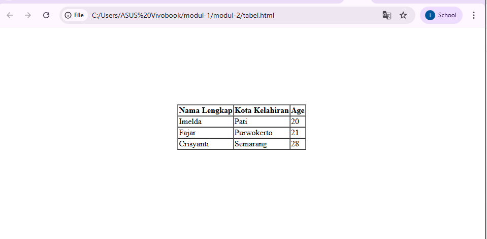

<h1 align="center">LAPORAN PRAKTIKUM</h1>
<h1 align="center">APLIKASI BERBASIS PLATFORM</h1>

<br>

<h2 align="center">MODUL 2</h2>
<h2 align="center">HTML</h2>

<br><br>

<p align="center">

</p>

<br><br><br>

<h2 align="center">Disusun Oleh :</h2>

<p align="center">
  <b>Imelda Fajar</b><br>
  <b>2311102004</b><br>
  <b>S1 IF-11-REG 01</b>
</p>

<br>

<h2 align="center">Dosen Pengampu :</h2>

<p align="center">
  <b>Dimas Fanny Hebrasianto Permadi, S.ST., M.Kom</b>
</p>

<br>

<h2 align="center">Asisten Praktikum :</h2>

<p align="center">
  <b>Apri Pandu Wicaksono</b><br>
  <b>Rangga Pradarrell Fathi</b>
</p>

<br>

<h1 align="center">LABORATORIUM HIGH PERFORMANCE</h1>
<h1 align="center">FAKULTAS INFORMATIKA</h1>
<h1 align="center">UNIVERSITAS TELKOM PURWOKERTO</h1>
<h1 align="center">TAHUN 2026</h1>

<hr>

## Dasar Teori
HTML (HyperText Markup Language) adalah bahasa markup yang digunakan untuk menyusun dan menampilkan struktur dasar halaman web. Dengan HTML, berbagai elemen seperti teks, gambar, link, dan tabel dapat ditampilkan secara terstruktur di browser.

Salah satu elemen yang sering digunakan dalam HTML adalah tabel. Tabel berfungsi untuk menyajikan data dalam bentuk baris dan kolom agar lebih mudah dibaca dan dipahami. Pembuatan tabel dilakukan dengan beberapa tag utama seperti `<table>` sebagai wadah, `<tr>` untuk baris, `<th>` untuk judul kolom, dan `<td>` untuk isi data.

Selain itu, dalam pembuatan tampilan sederhana tanpa CSS, HTML juga menyediakan tag `<center>` untuk mengatur posisi ke tengah dan `<br>` untuk memberi jarak antar elemen.

---

## Source Code
```html
<!DOCTYPE html>
<html>
<head>
<title>Tugas 2 - Tabel Dasar</title>
</head>

<body>

</body>
</html>

<br><br><br><br><br><br><br><br>

<center>
<table border="1" cellspacing="0">
<tr>
<th>Nama Lengkap</th>
<th>Kota Kelahiran</th>
<th>Age</th>
</tr>

<tr>
<td>Imelda</td>
<td>Pati</td>
<td>20</td>
</tr>

<tr>
<td>Fajar</td>
<td>Purwokerto</td>
<td>21</td>
</tr>

<tr>
<td>Crisyanti</td>
<td>Semarang</td>
<td>28</td>
</tr>

</table>
</center>

</body>
</html>
```

### Output 
Output program menampilkan sebuah tabel sederhana yang berada di tengah halaman. Tabel tersebut memiliki 3 kolom, yaitu Nama Lengkap, Kota Kelahiran, dan Age, serta berisi 3 baris data.



### Pembahasan Source Code
Program ini dibuat menggunakan HTML untuk menampilkan sebuah tabel sederhana yang berisi data nama, kota kelahiran, dan usia. Struktur dasar dokumen HTML diawali dengan <!DOCTYPE html> yang berfungsi sebagai deklarasi bahwa file menggunakan standar HTML5, sehingga browser dapat menampilkan halaman dengan benar. 
Tag <html> merupakan elemen utama yang membungkus seluruh isi dokumen HTML. Di dalamnya terdapat dua bagian utama, yaitu <head> dan <body>. Bagian <head> digunakan untuk menyimpan informasi yang tidak ditampilkan langsung di halaman, seperti judul halaman yang dituliskan dalam tag <title>. Judul tersebut akan muncul pada tab browser. 
Bagian <body> merupakan bagian utama yang berisi semua elemen yang akan ditampilkan kepada pengguna. Pada program ini, digunakan beberapa tag <br> untuk memberikan jarak atau spasi ke bawah agar tampilan tabel tidak berada terlalu atas, sehingga terlihat lebih rapi di tengah halaman secara vertikal. 
Untuk mengatur posisi tabel agar berada di tengah secara horizontal, digunakan tag <center>. Tag ini berfungsi untuk menempatkan elemen di tengah halaman, meskipun dalam praktik modern biasanya digantikan dengan CSS. 
Pembuatan tabel dilakukan dengan menggunakan tag <table>. Pada tag ini terdapat atribut border="1" yang berfungsi untuk menampilkan garis pada tabel sehingga batas antar sel terlihat jelas. Selain itu, digunakan atribut cellspacing="0" untuk menghilangkan jarak antar sel, sehingga garis tabel tampak menyatu dan lebih rapi. 
Di dalam tabel, digunakan tag <tr> (table row) untuk membuat baris. Baris pertama digunakan sebagai header tabel yang berisi judul kolom. Untuk membuat judul kolom digunakan tag <th> (table header), yaitu "Nama Lengkap", "Kota Kelahiran", dan "Age". Tag <th> secara otomatis membuat teks menjadi tebal dan berada di tengah. 
Baris berikutnya digunakan untuk menampilkan data. Setiap data dimasukkan menggunakan tag <td> (table data). Pada program ini terdapat tiga baris data, yaitu: 
Imelda, Pati, 20 
Fajar, Purwokerto, 21 
Crisyanti, Semarang, 28 
Setiap baris data dipisahkan menggunakan tag <tr>, sehingga tabel tersusun secara terstruktur dalam bentuk baris dan kolom. Secara keseluruhan, program ini berhasil menampilkan tabel sederhana yang berisi data identitas dengan rapi. Meskipun tidak menggunakan CSS, tampilan tetap dapat diatur dengan memanfaatkan tag HTML dasar seperti <center> dan <br>. Program ini menunjukkan pemahaman dasar dalam penggunaan struktur HTML dan pembuatan tabel.

### Kesimpulan
Berdasarkan hasil praktikum yang telah dilakukan, dapat disimpulkan bahwa HTML mampu digunakan untuk membuat tampilan halaman web sederhana, khususnya dalam menampilkan data berbentuk tabel. Pada program yang dibuat, data berupa nama, kota kelahiran, dan usia berhasil ditampilkan dengan baik menggunakan tabel. Selain itu, meskipun tidak menggunakan CSS, tampilan tetap dapat diatur agar terlihat lebih rapi dengan memanfaatkan tag <center> untuk penempatan di tengah dan <br> untuk memberikan jarak antar elemen. Dengan demikian, praktikum ini membantu dalam memahami dasar penggunaan HTML, khususnya dalam pembuatan tabel serta pengaturan tampilan sederhana. Hasil yang diperoleh sudah sesuai dengan tujuan praktikum, yaitu menampilkan data dalam bentuk tabel secara jelas dan terorganisir. 
