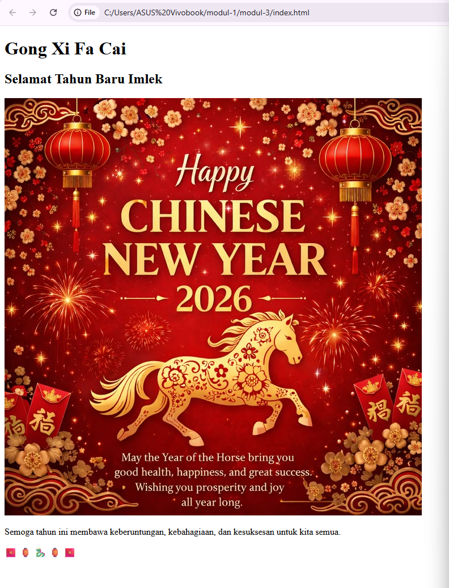

<h1 align="center">LAPORAN PRAKTIKUM</h1>
<h1 align="center">APLIKASI BERBASIS PLATFORM</h1>

<br>

<h2 align="center">MODUL 3</h2>
<h2 align="center">HTML & CSS - TEMA IMLEK</h2>

<br><br>

<p align="center">
  
</p>

<br><br>

<h2 align="center">Disusun Oleh :</h2>

<p align="center" style="font-size:28px;">
  <b>Imelda Fajar</b><br>
  <b>2311102004</b><br>
  <b>SI IF 11 REG 01</b>
</p>

<br>

<h2 align="center">Dosen Pengampu :</h2>

<p align="center" style="font-size:28px;">
  <b>Dimas Fanny Hebrasianto Permadi, S.ST., M.Kom</b>
</p>

<br>

<h2 align="center">Asisten Praktikum :</h2>

<p align="center" style="font-size:28px;">
  <b>Apri Pandu Wicaksono</b><br> 
  <b>Rangga Pradarrell Fathi</b>
</p>

<br>

<h1 align="center">LABORATORIUM HIGH PERFORMANCE</h1>
<h1 align="center">FAKULTAS INFORMATIKA</h1>
<h1 align="center">UNIVERSITAS TELKOM PURWOKERTO</h1>
<h1 align="center">TAHUN 2026</h1>

<hr>

### Dasar Teori

HTML (HyperText Markup Language) merupakan bahasa dasar yang digunakan untuk membuat struktur halaman web. HTML berfungsi untuk menyusun elemen-elemen seperti teks, gambar, dan konten lainnya agar dapat ditampilkan di browser secara teratur.

CSS (Cascading Style Sheets) digunakan untuk mengatur tampilan atau desain dari halaman HTML. Dengan CSS, tampilan halaman dapat dibuat lebih menarik, seperti mengatur warna, ukuran teks, tata letak, dan efek visual lainnya.

Pada praktikum ini, HTML digunakan untuk membuat halaman bertema Tahun Baru Imlek, sedangkan CSS digunakan untuk mempercantik tampilan dengan warna merah dan emas serta menambahkan elemen dekoratif agar lebih menarik.


## Source Code

### HTML (index.html)

```html
<!DOCTYPE html>
<html lang="id">
<head>
    <meta charset="UTF-8">
    <title>Selamat Tahun Baru Imlek</title>
    <link rel="stylesheet" href="style.css">
</head>
<body>

<div class="container">
    <h1>Gong Xi Fa Cai</h1>
    <h2>Selamat Tahun Baru Imlek</h2>

    

    <p>
        Semoga tahun ini membawa keberuntungan, kebahagiaan, dan kesuksesan untuk kita semua.
    </p>

    <div class="hiasan">
        🧧 🏮 🐉 🏮 🧧
    </div>
</div>

</body>
</html>

```

### Source Code CSS
```
body {
    margin: 0;
    padding: 0;
    font-family: Arial, sans-serif;
    background: linear-gradient(to bottom, #8B0000, #FF0000);
    color: gold;
    text-align: center;
}

.container {
    padding: 50px 20px;
}

h1 {
    font-size: 50px;
    margin-bottom: 10px;
}

h2 {
    font-size: 25px;
    margin-bottom: 20px;
}

.gambar {
    width: 300px;
    border: 5px solid gold;
    border-radius: 10px;
    margin-top: 20px;
}

.hiasan {
    margin-top: 25px;
    font-size: 28px;
}

```

## Output



Hasil dari program ini adalah halaman web bertema Tahun Baru Imlek dengan dominasi warna merah dan emas. Halaman menampilkan judul utama, subjudul, gambar, teks ucapan, serta elemen dekoratif emoji yang memperkuat nuansa Imlek.


### Penjelasan Kode Program

Program ini dibuat menggunakan HTML untuk membangun struktur halaman dan CSS untuk mengatur tampilan halaman web bertema Tahun Baru Imlek.

Pada HTML, &lt;!DOCTYPE html&gt; digunakan untuk mendefinisikan dokumen HTML5, sedangkan &lt;html lang="id"&gt; menunjukkan bahasa halaman adalah Bahasa Indonesia. Di dalam &lt;head&gt;, terdapat &lt;meta charset="UTF-8"&gt; untuk mendukung karakter dan emoji, &lt;title&gt; untuk judul halaman di tab browser, serta &lt;link rel="stylesheet" href="style.css"&gt; untuk menghubungkan file CSS eksternal.

Pada bagian &lt;body&gt;, seluruh konten diletakkan di dalam &lt;div class="container"&gt; sebagai wadah utama. Di dalamnya terdapat &lt;h1&gt; dan &lt;h2&gt; sebagai judul dan subjudul, &lt;img&gt; untuk menampilkan gambar bertema Imlek dengan class gambar, serta &lt;p&gt; untuk menampilkan teks ucapan.

Selain itu, terdapat &lt;div class="hiasan"&gt; yang berisi emoji 🧧🏮🐉 sebagai elemen dekoratif untuk mempercantik tampilan halaman.

Pada CSS, digunakan linear-gradient untuk membuat latar belakang gradasi warna merah, serta color: gold untuk memberi warna teks agar sesuai dengan tema Imlek. Properti text-align: center digunakan agar seluruh elemen berada di tengah halaman.

Class .container berfungsi untuk memberi jarak pada isi halaman, .gambar untuk mengatur ukuran, border emas, dan sudut melengkung pada gambar, sedangkan .hiasan digunakan untuk memperbesar dan memberi jarak pada emoji.

Secara keseluruhan, HTML digunakan sebagai struktur halaman, sedangkan CSS digunakan untuk memperindah tampilan sehingga menghasilkan halaman web yang rapi, menarik, dan sesuai dengan tema Imlek.


## Kesimpulan

Berdasarkan praktikum yang telah dilakukan, dapat disimpulkan bahwa HTML dan CSS sangat penting dalam pembuatan halaman web.

HTML berfungsi sebagai struktur utama halaman, sedangkan CSS berfungsi untuk memperindah tampilan. Kombinasi keduanya menghasilkan halaman web bertema Imlek yang menarik, rapi, dan mudah dibaca.
```
