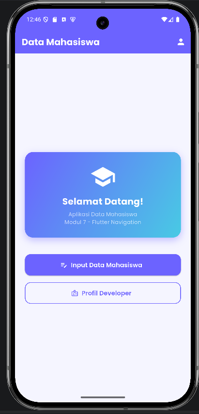
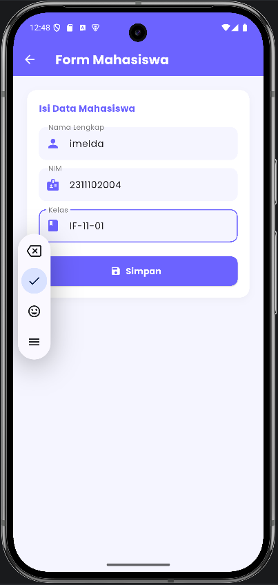
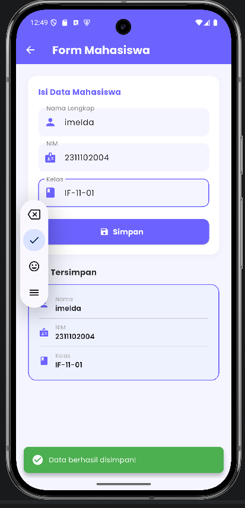
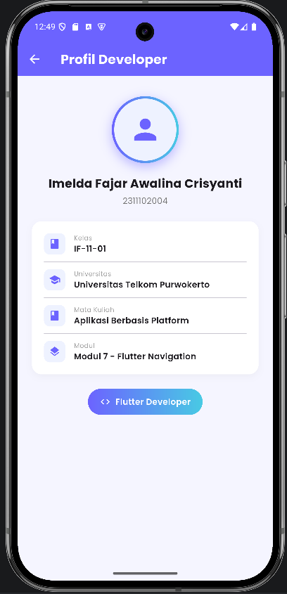

<div align="center">
  <br />
  <h1>LAPORAN PRAKTIKUM <br> APLIKASI BERBASIS PLATFORM</h1>
  <br />
  <h3>MODUL 7 <br> FLUTTER</h3>
  <br />
  
  <br />
  <br />
  <h3>Disusun Oleh :</h3>
  <p>
    <strong>Imelda Fajar Awalina Crisyanti</strong><br>
    <strong>2311102004</strong><br>
    <strong>IF 11 01</strong>
  </p>
  <br />
  <h3>Dosen Pengampu :</h3>
  <p>
    <strong>Dimas Fanny Hebrasianto Permadi, S.ST., M.Kom</strong>
  </p>
  <br />
  <h4>Asisten Praktikum :</h4>
  <p>
    <strong>Apri Pandu Wicaksono</strong><br>
    <strong>Rangga Pradarrell Fathi</strong>
  </p>
  <br />
  <h3>LABORATORIUM HIGH PERFORMANCE<br>FAKULTAS INFORMATIKA<br>UNIVERSITAS TELKOM PURWOKERTO<br>2026</h3>
</div>

---

## Dasar Teori

Flutter adalah framework UI open-source dari Google untuk membangun aplikasi multiplatform dari satu codebase menggunakan bahasa Dart. Dalam pengembangan aplikasi mobile modern, Flutter mengandalkan sistem widget yang bersifat deklaratif, di mana seluruh tampilan dibangun dari susunan widget yang dapat bersifat `StatelessWidget` (tidak memiliki state yang berubah) maupun `StatefulWidget` (memiliki state dinamis yang dapat diperbarui). Fitur Hot Reload pada Flutter mempercepat siklus pengembangan dengan memungkinkan perubahan kode terefleksi secara instan tanpa perlu memuat ulang seluruh aplikasi.

Navigasi antar halaman pada Flutter dikelola menggunakan `Navigator`, yang bekerja seperti tumpukan (*stack*) halaman. Perintah `Navigator.push` digunakan untuk berpindah ke halaman baru dengan menambahkannya ke atas tumpukan, sementara `Navigator.pop` digunakan untuk kembali ke halaman sebelumnya dengan mengeluarkan halaman teratas dari tumpukan. Untuk memperkaya tampilan antarmuka, Flutter mendukung penggunaan paket pihak ketiga seperti `google_fonts` yang memungkinkan pengembang mengakses ratusan tipografi dari Google Fonts secara langsung di dalam aplikasi.

---

## Tugas 7 — Flutter

### 1. Source Code `lib/main.dart`

```dart
// Imelda Fajar Awalina Crisyanti
// [Isi NIM Di Sini]
// [Isi Kelas Di Sini]
import 'package:flutter/material.dart';
import 'package:google_fonts/google_fonts.dart';
import 'pages/home_page.dart';

void main() {
  runApp(const MyApp());
}

class MyApp extends StatelessWidget {
  const MyApp({super.key});

  @override
  Widget build(BuildContext context) {
    return MaterialApp(
      title: 'Data Mahasiswa',
      debugShowCheckedModeBanner: false,
      theme: ThemeData(
        colorScheme: ColorScheme.fromSeed(
          seedColor: const Color(0xFF6C63FF),
          primary: const Color(0xFF6C63FF),
        ),
        textTheme: GoogleFonts.poppinsTextTheme(),
        useMaterial3: true,
      ),
      home: const HomePage(),
    );
  }
}
```

**Kode Lengkap : [lib/main.dart](lib/main.dart)**

---

### 2. Source Code `lib/pages/home_page.dart`

```dart
// Imelda Fajar Awalina Crisyanti
// [Isi NIM Di Sini]
// [Isi Kelas Di Sini]
import 'package:flutter/material.dart';
import 'package:google_fonts/google_fonts.dart';
import 'form_page.dart';
import 'profil_page.dart';

class HomePage extends StatelessWidget {
  const HomePage({super.key});

  @override
  Widget build(BuildContext context) {
    return Scaffold(
      backgroundColor: const Color(0xFFF5F5FF),
      appBar: AppBar(
        title: Text(
          'Data Mahasiswa',
          style: GoogleFonts.poppins(
            fontWeight: FontWeight.bold,
            color: Colors.white,
          ),
        ),
        backgroundColor: const Color(0xFF6C63FF),
        elevation: 0,
        actions: [
          IconButton(
            icon: const Icon(Icons.person, color: Colors.white),
            onPressed: () {
              Navigator.push(
                context,
                MaterialPageRoute(builder: (_) => const ProfilPage()),
              );
            },
          ),
        ],
      ),
      body: Center(
        child: Padding(
          padding: const EdgeInsets.all(24.0),
          child: Column(
            mainAxisAlignment: MainAxisAlignment.center,
            children: [
              Container(
                width: double.infinity,
                padding: const EdgeInsets.all(28),
                decoration: BoxDecoration(
                  gradient: const LinearGradient(
                    colors: [Color(0xFF6C63FF), Color(0xFF48CAE4)],
                    begin: Alignment.topLeft,
                    end: Alignment.bottomRight,
                  ),
                  borderRadius: BorderRadius.circular(20),
                  boxShadow: [
                    BoxShadow(
                      color: const Color(0xFF6C63FF).withOpacity(0.4),
                      blurRadius: 15,
                      offset: const Offset(0, 6),
                    ),
                  ],
                ),
                child: Column(
                  children: [
                    const Icon(Icons.school, size: 64, color: Colors.white),
                    const SizedBox(height: 12),
                    Text(
                      'Selamat Datang!',
                      style: GoogleFonts.poppins(
                        fontSize: 22,
                        fontWeight: FontWeight.bold,
                        color: Colors.white,
                      ),
                    ),
                    const SizedBox(height: 6),
                    Text(
                      'Aplikasi Data Mahasiswa\nModul 7 - Flutter Navigation',
                      textAlign: TextAlign.center,
                      style: GoogleFonts.poppins(
                        fontSize: 13,
                        color: Colors.white70,
                      ),
                    ),
                  ],
                ),
              ),
              const SizedBox(height: 40),
              SizedBox(
                width: double.infinity,
                height: 52,
                child: ElevatedButton.icon(
                  onPressed: () {
                    Navigator.push(
                      context,
                      MaterialPageRoute(builder: (_) => const FormPage()),
                    );
                  },
                  icon: const Icon(Icons.edit_note, color: Colors.white),
                  label: Text(
                    'Input Data Mahasiswa',
                    style: GoogleFonts.poppins(
                      fontSize: 15,
                      fontWeight: FontWeight.w600,
                      color: Colors.white,
                    ),
                  ),
                  style: ElevatedButton.styleFrom(
                    backgroundColor: const Color(0xFF6C63FF),
                    shape: RoundedRectangleBorder(
                      borderRadius: BorderRadius.circular(14),
                    ),
                  ),
                ),
              ),
              const SizedBox(height: 16),
              SizedBox(
                width: double.infinity,
                height: 52,
                child: OutlinedButton.icon(
                  onPressed: () {
                    Navigator.push(
                      context,
                      MaterialPageRoute(builder: (_) => const ProfilPage()),
                    );
                  },
                  icon: const Icon(Icons.badge_outlined, color: Color(0xFF6C63FF)),
                  label: Text(
                    'Profil Developer',
                    style: GoogleFonts.poppins(
                      fontSize: 15,
                      fontWeight: FontWeight.w600,
                      color: const Color(0xFF6C63FF),
                    ),
                  ),
                  style: OutlinedButton.styleFrom(
                    side: const BorderSide(color: Color(0xFF6C63FF), width: 1.5),
                    shape: RoundedRectangleBorder(
                      borderRadius: BorderRadius.circular(14),
                    ),
                  ),
                ),
              ),
            ],
          ),
        ),
      ),
    );
  }
}
```

**Kode Lengkap : [lib/pages/home_page.dart](lib/pages/home_page.dart)**

---

### 3. Source Code `lib/pages/form_page.dart`

```dart
// Imelda Fajar Awalina Crisyanti
// [Isi NIM Di Sini]
// [Isi Kelas Di Sini]
import 'package:flutter/material.dart';
import 'package:google_fonts/google_fonts.dart';

class FormPage extends StatefulWidget {
  const FormPage({super.key});

  @override
  State<FormPage> createState() => _FormPageState();
}

class _FormPageState extends State<FormPage> {
  final TextEditingController _namaController = TextEditingController();
  final TextEditingController _nimController = TextEditingController();
  final TextEditingController _kelasController = TextEditingController();

  String _dataNama = '';
  String _dataNim = '';
  String _dataKelas = '';
  bool _sudahSimpan = false;

  void _simpanData() {
    if (_namaController.text.isEmpty ||
        _nimController.text.isEmpty ||
        _kelasController.text.isEmpty) {
      ScaffoldMessenger.of(context).showSnackBar(
        SnackBar(
          content: Text('Semua field wajib diisi!', style: GoogleFonts.poppins()),
          backgroundColor: Colors.redAccent,
          behavior: SnackBarBehavior.floating,
          shape: RoundedRectangleBorder(borderRadius: BorderRadius.circular(10)),
        ),
      );
      return;
    }

    setState(() {
      _dataNama = _namaController.text;
      _dataNim = _nimController.text;
      _dataKelas = _kelasController.text;
      _sudahSimpan = true;
    });

    ScaffoldMessenger.of(context).showSnackBar(
      SnackBar(
        content: Row(
          children: [
            const Icon(Icons.check_circle, color: Colors.white),
            const SizedBox(width: 10),
            Text('Data berhasil disimpan!',
                style: GoogleFonts.poppins(color: Colors.white)),
          ],
        ),
        backgroundColor: const Color(0xFF4CAF50),
        behavior: SnackBarBehavior.floating,
        shape: RoundedRectangleBorder(borderRadius: BorderRadius.circular(10)),
        duration: const Duration(seconds: 2),
      ),
    );
  }

  @override
  Widget build(BuildContext context) {
    return Scaffold(
      backgroundColor: const Color(0xFFF5F5FF),
      appBar: AppBar(
        title: Text(
          'Form Mahasiswa',
          style: GoogleFonts.poppins(fontWeight: FontWeight.bold, color: Colors.white),
        ),
        backgroundColor: const Color(0xFF6C63FF),
        elevation: 0,
        leading: IconButton(
          icon: const Icon(Icons.arrow_back, color: Colors.white),
          onPressed: () => Navigator.pop(context),
        ),
      ),
      body: SingleChildScrollView(
        padding: const EdgeInsets.all(24),
        child: Column(
          crossAxisAlignment: CrossAxisAlignment.start,
          children: [
            Container(
              padding: const EdgeInsets.all(20),
              decoration: BoxDecoration(
                color: Colors.white,
                borderRadius: BorderRadius.circular(16),
                boxShadow: [
                  BoxShadow(
                    color: Colors.grey.withOpacity(0.1),
                    blurRadius: 10,
                    offset: const Offset(0, 4),
                  ),
                ],
              ),
              child: Column(
                crossAxisAlignment: CrossAxisAlignment.start,
                children: [
                  Text(
                    'Isi Data Mahasiswa',
                    style: GoogleFonts.poppins(
                      fontSize: 16,
                      fontWeight: FontWeight.bold,
                      color: const Color(0xFF6C63FF),
                    ),
                  ),
                  const SizedBox(height: 20),
                  _buildTextField(_namaController, 'Nama Lengkap', Icons.person),
                  const SizedBox(height: 14),
                  _buildTextField(_nimController, 'NIM', Icons.badge),
                  const SizedBox(height: 14),
                  _buildTextField(_kelasController, 'Kelas', Icons.class_),
                  const SizedBox(height: 24),
                  SizedBox(
                    width: double.infinity,
                    height: 50,
                    child: ElevatedButton.icon(
                      onPressed: _simpanData,
                      icon: const Icon(Icons.save, color: Colors.white),
                      label: Text(
                        'Simpan',
                        style: GoogleFonts.poppins(
                          fontSize: 15,
                          fontWeight: FontWeight.bold,
                          color: Colors.white,
                        ),
                      ),
                      style: ElevatedButton.styleFrom(
                        backgroundColor: const Color(0xFF6C63FF),
                        shape: RoundedRectangleBorder(
                          borderRadius: BorderRadius.circular(12),
                        ),
                      ),
                    ),
                  ),
                ],
              ),
            ),
            const SizedBox(height: 24),
            if (_sudahSimpan) ...[
              Text(
                'Data Tersimpan',
                style: GoogleFonts.poppins(
                  fontSize: 16,
                  fontWeight: FontWeight.bold,
                  color: const Color(0xFF333333),
                ),
              ),
              const SizedBox(height: 12),
              Container(
                width: double.infinity,
                padding: const EdgeInsets.all(20),
                decoration: BoxDecoration(
                  color: const Color(0xFFEEF2FF),
                  borderRadius: BorderRadius.circular(16),
                  border: Border.all(color: const Color(0xFF6C63FF), width: 1.5),
                ),
                child: Column(
                  children: [
                    _buildDataRow(Icons.person, 'Nama', _dataNama),
                    const Divider(height: 20),
                    _buildDataRow(Icons.badge, 'NIM', _dataNim),
                    const Divider(height: 20),
                    _buildDataRow(Icons.class_, 'Kelas', _dataKelas),
                  ],
                ),
              ),
            ],
          ],
        ),
      ),
    );
  }

  Widget _buildTextField(
      TextEditingController controller, String label, IconData icon) {
    return TextField(
      controller: controller,
      decoration: InputDecoration(
        labelText: label,
        labelStyle: GoogleFonts.poppins(color: Colors.grey[600]),
        prefixIcon: Icon(icon, color: const Color(0xFF6C63FF)),
        filled: true,
        fillColor: const Color(0xFFF5F5FF),
        border: OutlineInputBorder(
          borderRadius: BorderRadius.circular(12),
          borderSide: BorderSide.none,
        ),
        focusedBorder: OutlineInputBorder(
          borderRadius: BorderRadius.circular(12),
          borderSide: const BorderSide(color: Color(0xFF6C63FF), width: 1.5),
        ),
      ),
    );
  }

  Widget _buildDataRow(IconData icon, String label, String value) {
    return Row(
      children: [
        Icon(icon, color: const Color(0xFF6C63FF), size: 20),
        const SizedBox(width: 12),
        Column(
          crossAxisAlignment: CrossAxisAlignment.start,
          children: [
            Text(label,
                style: GoogleFonts.poppins(fontSize: 11, color: Colors.grey)),
            Text(value,
                style: GoogleFonts.poppins(
                    fontSize: 14, fontWeight: FontWeight.w600)),
          ],
        ),
      ],
    );
  }
}
```

**Kode Lengkap : [lib/pages/form_page.dart](lib/pages/form_page.dart)**

---

### 4. Source Code `lib/pages/profil_page.dart`

```dart
// Imelda Fajar Awalina Crisyanti
// [Isi NIM Di Sini]
// [Isi Kelas Di Sini]
import 'package:flutter/material.dart';
import 'package:google_fonts/google_fonts.dart';

class ProfilPage extends StatelessWidget {
  const ProfilPage({super.key});

  @override
  Widget build(BuildContext context) {
    return Scaffold(
      backgroundColor: const Color(0xFFF5F5FF),
      appBar: AppBar(
        title: Text(
          'Profil Developer',
          style: GoogleFonts.poppins(fontWeight: FontWeight.bold, color: Colors.white),
        ),
        backgroundColor: const Color(0xFF6C63FF),
        elevation: 0,
        leading: IconButton(
          icon: const Icon(Icons.arrow_back, color: Colors.white),
          onPressed: () => Navigator.pop(context),
        ),
      ),
      body: SingleChildScrollView(
        padding: const EdgeInsets.all(24),
        child: Column(
          children: [
            const SizedBox(height: 10),
            Container(
              padding: const EdgeInsets.all(4),
              decoration: BoxDecoration(
                shape: BoxShape.circle,
                gradient: const LinearGradient(
                  colors: [Color(0xFF6C63FF), Color(0xFF48CAE4)],
                ),
                boxShadow: [
                  BoxShadow(
                    color: const Color(0xFF6C63FF).withOpacity(0.4),
                    blurRadius: 15,
                    offset: const Offset(0, 6),
                  ),
                ],
              ),
              child: const CircleAvatar(
                radius: 52,
                backgroundColor: Color(0xFFEEF2FF),
                child: Icon(Icons.person, size: 56, color: Color(0xFF6C63FF)),
              ),
            ),
            const SizedBox(height: 20),
            Text(
              'Imelda Fajar Awalina Crisyanti',
              style: GoogleFonts.poppins(fontSize: 20, fontWeight: FontWeight.bold),
            ),
            const SizedBox(height: 4),
            Text(
              '[Isi NIM Di Sini]',
              style: GoogleFonts.poppins(fontSize: 14, color: Colors.grey[600]),
            ),
            const SizedBox(height: 24),
            Container(
              width: double.infinity,
              padding: const EdgeInsets.all(20),
              decoration: BoxDecoration(
                color: Colors.white,
                borderRadius: BorderRadius.circular(16),
                boxShadow: [
                  BoxShadow(
                    color: Colors.grey.withOpacity(0.1),
                    blurRadius: 10,
                    offset: const Offset(0, 4),
                  ),
                ],
              ),
              child: Column(
                children: [
                  _buildInfoRow(Icons.class_, 'Kelas', '[Isi Kelas Di Sini]'),
                  const Divider(height: 24),
                  _buildInfoRow(Icons.school, 'Universitas', 'Universitas Telkom Purwokerto'),
                  const Divider(height: 24),
                  _buildInfoRow(Icons.book, 'Mata Kuliah', 'Aplikasi Berbasis Platform'),
                  const Divider(height: 24),
                  _buildInfoRow(Icons.layers, 'Modul', 'Modul 7 - Flutter Navigation'),
                ],
              ),
            ),
            const SizedBox(height: 24),
            Container(
              padding: const EdgeInsets.symmetric(horizontal: 20, vertical: 12),
              decoration: BoxDecoration(
                gradient: const LinearGradient(
                  colors: [Color(0xFF6C63FF), Color(0xFF48CAE4)],
                ),
                borderRadius: BorderRadius.circular(30),
              ),
              child: Row(
                mainAxisSize: MainAxisSize.min,
                children: [
                  const Icon(Icons.code, color: Colors.white, size: 18),
                  const SizedBox(width: 8),
                  Text(
                    'Flutter Developer',
                    style: GoogleFonts.poppins(
                      color: Colors.white,
                      fontWeight: FontWeight.w600,
                    ),
                  ),
                ],
              ),
            ),
          ],
        ),
      ),
    );
  }

  Widget _buildInfoRow(IconData icon, String label, String value) {
    return Row(
      children: [
        Container(
          padding: const EdgeInsets.all(8),
          decoration: BoxDecoration(
            color: const Color(0xFFEEF2FF),
            borderRadius: BorderRadius.circular(10),
          ),
          child: Icon(icon, color: const Color(0xFF6C63FF), size: 20),
        ),
        const SizedBox(width: 14),
        Column(
          crossAxisAlignment: CrossAxisAlignment.start,
          children: [
            Text(label,
                style: GoogleFonts.poppins(fontSize: 11, color: Colors.grey)),
            Text(value,
                style: GoogleFonts.poppins(
                    fontSize: 14, fontWeight: FontWeight.w600)),
          ],
        ),
      ],
    );
  }
}
```

**Kode Lengkap : [lib/pages/profil_page.dart](lib/pages/profil_page.dart)**

---

## Output

Berikut adalah hasil tangkapan layar (screenshot) implementasi antarmuka aplikasi **Data Mahasiswa**:

| Halaman Utama (Home) | Halaman Form Mahasiswa |
| :---: | :---: |
|  |  |

| Notifikasi SnackBar Berhasil | Halaman Profil Developer |
| :---: | :---: |
|  |  |

---

## Penjelasan

Aplikasi **Data Mahasiswa** merupakan aplikasi Flutter sederhana bertema manajemen data mahasiswa yang dibangun untuk memenuhi tugas eksplorasi navigasi dan widget pada Modul 7. Aplikasi ini terdiri dari 3 halaman utama yang saling terhubung menggunakan sistem navigasi Flutter.

### 1. Navigasi Antar Halaman
Perpindahan halaman diimplementasikan menggunakan `Navigator.push` dan `Navigator.pop`. Dari halaman **Home**, pengguna dapat berpindah ke halaman **Form Mahasiswa** maupun **Profil Developer** melalui tombol yang tersedia. Tombol kembali (`arrow_back`) di setiap `AppBar` memanggil `Navigator.pop` untuk kembali ke halaman sebelumnya.

### 2. StatefulWidget & StatelessWidget
- `HomePage` dan `ProfilPage` menggunakan `StatelessWidget` karena tidak memiliki data yang berubah secara dinamis.
- `FormPage` menggunakan `StatefulWidget` melalui `_FormPageState` karena perlu mengelola perubahan state, yaitu menyimpan data input pengguna (`_dataNama`, `_dataNim`, `_dataKelas`) dan menampilkan kartu hasil input setelah tombol Simpan ditekan.

### 3. Form & Validasi Input
Form pada halaman `FormPage` memiliki tiga `TextField` untuk mengisi Nama, NIM, dan Kelas. Saat tombol **Simpan** ditekan, fungsi `_simpanData()` memvalidasi apakah seluruh field telah diisi. Jika ada field yang kosong, muncul `SnackBar` berwarna merah sebagai peringatan. Jika semua field terisi, data ditampilkan dalam kartu hasil di bawah form dan muncul `SnackBar` hijau sebagai notifikasi keberhasilan.

### 4. Google Fonts
Seluruh teks dalam aplikasi menggunakan tipografi **Poppins** dari paket `google_fonts`, diterapkan secara global melalui `GoogleFonts.poppinsTextTheme()` pada konfigurasi tema di `main.dart` sehingga konsisten di seluruh halaman tanpa perlu mengatur font secara manual di setiap widget.

### 5. Widget yang Digunakan

| Widget | Keterangan |
|--------|------------|
| `AppBar` | Header navigasi di setiap halaman dengan warna ungu `#6C63FF` |
| `Container` | Banner utama di Home dengan gradient, border radius, dan box shadow |
| `Column` | Menyusun widget secara vertikal di seluruh halaman |
| `ElevatedButton` | Tombol aksi utama (Input Data, Simpan) |
| `OutlinedButton` | Tombol sekunder (Profil Developer) |
| `TextField` | Input field untuk Nama, NIM, dan Kelas |
| `SnackBar` | Notifikasi floating hasil validasi dan penyimpanan data |
| `CircleAvatar` | Avatar ikon profil di halaman Profil |
| `Icon` | Ikon dekoratif di seluruh halaman |
| `Navigator.push` | Berpindah ke halaman baru |
| `Navigator.pop` | Kembali ke halaman sebelumnya |
