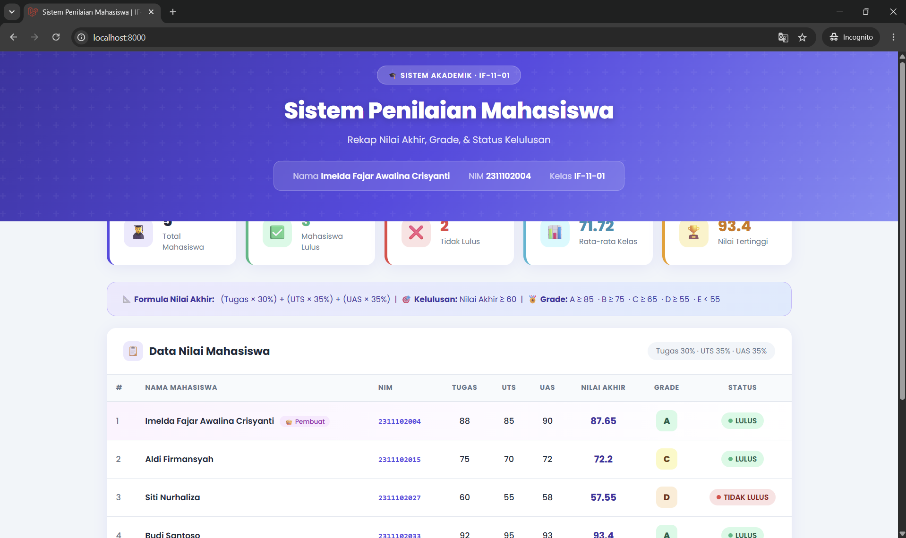

<div align="center">
    <br />
    <h1>LAPORAN PRAKTIKUM <br> APLIKASI BERBASIS PLATFORM </h1>
    <br />
    <h3>MODUL 9 <br> PHP </h3>
    <br />
    
    <br />
    <br />
    <br />
    <h3>Disusun Oleh :</h3>
    <p>
        <strong>Imelda Fajar Awalina Crisyanti</strong>
        <br>
        <strong>2311102004</strong>
        <br>
        <strong>S1 IF-11-01</strong>
    </p>
    <br />
    <h3>Dosen Pengampu :</h3>
    <p>
        <strong>Dimas Fanny Hebrasianto, S.ST., M.Kom</strong>
    </p>
    <br />
    <br />
    <h4>Asisten Praktikum :</h4>
    <strong>Apri Pandu Wicaksono</strong>
    <br>
    <strong>Rangga Pradarrel Fathi</strong>
    <br />
    <h3>LABORATORIUM HIGH PERFORMANCE <br>FAKULTAS INFORMATIKA <br>UNIVERSITAS TELKOM PURWOKERTO <br>2026 </h3>
</div>
<hr>

## Dasar Teori - PHP

PHP (Hypertext Preprocessor) adalah bahasa pemrograman sisi server (server-side scripting) yang dirancang khusus untuk pengembangan web dinamis. PHP bersifat open source dan dapat disisipkan langsung ke dalam kode HTML, sehingga memungkinkan pembuatan halaman web yang interaktif dan terhubung dengan basis data. Ketika pengguna mengakses halaman PHP, kode tersebut dieksekusi di server dan hasilnya berupa HTML murni yang dikirimkan ke browser klien. PHP mendukung berbagai fitur seperti pemrosesan formulir, manajemen sesi, penanganan file, serta komunikasi dengan database, menjadikannya salah satu bahasa paling populer untuk membangun sistem informasi dan aplikasi web skala besar.

Dalam praktikum ini, sistem penilaian mahasiswa dibangun menggunakan **Laravel Framework** — sebuah PHP framework modern yang mengikuti pola arsitektur **MVC (Model-View-Controller)**. Laravel menyederhanakan proses pengembangan web dengan menyediakan berbagai fitur bawaan seperti routing yang ekspresif, Blade templating engine, Eloquent ORM, serta ekosistem package yang lengkap. Sistem penilaian ini memanfaatkan array asosiatif PHP untuk menyimpan data mahasiswa, function kustom untuk menghitung nilai akhir berdasarkan bobot tugas, UTS, dan UAS, serta struktur kontrol if-else untuk menentukan grade dan status kelulusan. Seluruh data kemudian ditampilkan secara dinamis menggunakan Blade templating engine dalam bentuk tabel HTML yang interaktif dan responsif.

---

## Tugas Modul 9 - PHP: Sistem Penilaian Mahasiswa

### Deskripsi Project

**EduTrack** adalah sistem penilaian mahasiswa berbasis **Laravel Framework** yang menampilkan data nilai tugas, UTS, dan UAS dalam bentuk tabel interaktif. Sistem ini dilengkapi dengan perhitungan otomatis nilai akhir menggunakan bobot tertentu, penentuan grade A–E, status kelulusan, serta statistik kelas seperti rata-rata dan nilai tertinggi.

---

### Struktur Project

```
sistem-nilai/
├── app/
│   └── Http/
│       └── Controllers/
│           └── NilaiMahasiswaController.php
├── resources/
│   └── views/
│       └── nilai/
│           └── index.blade.php
├── routes/
│   └── web.php
└── .env
```

---

### Source Code

#### `NilaiMahasiswaController.php`

```php
<?php

namespace App\Http\Controllers;

use Illuminate\Routing\Controller;

class NilaiMahasiswaController extends Controller
{
    // Nama  : Imelda Fajar Awalina Crisyanti
    // NIM   : 2311102004
    // Kelas : IF-11-01

    private function hitungNilaiAkhir(float $tugas, float $uts, float $uas): float
    {
        return ($tugas * 0.30) + ($uts * 0.35) + ($uas * 0.35);
    }

    private function tentukanGrade(float $nilaiAkhir): string
    {
        if ($nilaiAkhir >= 85)      return 'A';
        elseif ($nilaiAkhir >= 75)  return 'B';
        elseif ($nilaiAkhir >= 65)  return 'C';
        elseif ($nilaiAkhir >= 55)  return 'D';
        else                        return 'E';
    }

    private function tentukanStatus(float $nilaiAkhir): string
    {
        return ($nilaiAkhir >= 60) ? 'LULUS' : 'TIDAK LULUS';
    }

    public function index()
    {
        $dataMahasiswa = [
            ['nama' => 'Imelda Fajar Awalina Crisyanti', 'nim' => '2311102004',
             'nilai_tugas' => 88, 'nilai_uts' => 85, 'nilai_uas' => 90, 'kelas' => 'IF-11-01'],
            ['nama' => 'Aldi Firmansyah', 'nim' => '2311102015',
             'nilai_tugas' => 75, 'nilai_uts' => 70, 'nilai_uas' => 72, 'kelas' => 'IF-11-01'],
            ['nama' => 'Siti Nurhaliza', 'nim' => '2311102027',
             'nilai_tugas' => 60, 'nilai_uts' => 55, 'nilai_uas' => 58, 'kelas' => 'IF-11-01'],
            ['nama' => 'Budi Santoso', 'nim' => '2311102033',
             'nilai_tugas' => 92, 'nilai_uts' => 95, 'nilai_uas' => 93, 'kelas' => 'IF-11-01'],
            ['nama' => 'Dewi Rahmawati', 'nim' => '2311102041',
             'nilai_tugas' => 45, 'nilai_uts' => 50, 'nilai_uas' => 48, 'kelas' => 'IF-11-01'],
        ];

        $hasilMahasiswa  = [];
        $totalNilaiAkhir = 0;
        $nilaiTertinggi  = 0;
        $mahasiswaTertinggi = '';

        foreach ($dataMahasiswa as $mhs) {
            $nilaiAkhir = $this->hitungNilaiAkhir(
                $mhs['nilai_tugas'], $mhs['nilai_uts'], $mhs['nilai_uas']
            );
            $grade  = $this->tentukanGrade($nilaiAkhir);
            $status = $this->tentukanStatus($nilaiAkhir);

            $hasilMahasiswa[] = [
                'nama'        => $mhs['nama'],
                'nim'         => $mhs['nim'],
                'kelas'       => $mhs['kelas'],
                'nilai_tugas' => $mhs['nilai_tugas'],
                'nilai_uts'   => $mhs['nilai_uts'],
                'nilai_uas'   => $mhs['nilai_uas'],
                'nilai_akhir' => round($nilaiAkhir, 2),
                'grade'       => $grade,
                'status'      => $status,
            ];

            $totalNilaiAkhir += $nilaiAkhir;
            if ($nilaiAkhir > $nilaiTertinggi) {
                $nilaiTertinggi     = $nilaiAkhir;
                $mahasiswaTertinggi = $mhs['nama'];
            }
        }

        $jumlahMahasiswa = count($hasilMahasiswa);
        $rataRataKelas   = round($totalNilaiAkhir / $jumlahMahasiswa, 2);
        $jumlahLulus     = count(array_filter(
            $hasilMahasiswa, fn($m) => $m['status'] === 'LULUS'
        ));

        return view('nilai.index', compact(
            'hasilMahasiswa', 'rataRataKelas', 'nilaiTertinggi',
            'mahasiswaTertinggi', 'jumlahMahasiswa', 'jumlahLulus'
        ));
    }
}
```

#### `routes/web.php`

```php
<?php

use Illuminate\Support\Facades\Route;
use App\Http\Controllers\NilaiMahasiswaController;

Route::get('/', [NilaiMahasiswaController::class, 'index']);
Route::get('/nilai', [NilaiMahasiswaController::class, 'index'])->name('nilai.index');
```

---

### Output / Hasil

> Screenshot diambil dari `http://localhost:8000` setelah menjalankan `php artisan serve`



---

### Penjelasan

Sistem penilaian mahasiswa ini dibangun menggunakan **Laravel Framework** dengan menerapkan pola **MVC (Model-View-Controller)**. Data mahasiswa disimpan dalam **array asosiatif** di dalam controller, kemudian diproses menggunakan tiga **function** kustom:

| Function | Kegunaan |
|---|---|
| `hitungNilaiAkhir()` | Menghitung nilai akhir dengan bobot Tugas 30%, UTS 35%, UAS 35% |
| `tentukanGrade()` | Menentukan grade A–E menggunakan operator `if-else` |
| `tentukanStatus()` | Menentukan status lulus/tidak menggunakan operator perbandingan `>=` |

Data diiterasi menggunakan **loop `foreach`** lalu dikirim ke Blade view menggunakan `compact()`. Tampilan menggunakan **Blade templating engine** dengan direktif `@foreach` untuk menampilkan seluruh data dalam tabel HTML. Statistik kelas seperti rata-rata, nilai tertinggi, dan jumlah kelulusan dihitung secara otomatis di controller.

**Formula Nilai Akhir:**
```
Nilai Akhir = (Tugas × 30%) + (UTS × 35%) + (UAS × 35%)
```

**Ketentuan Grade:**
| Nilai Akhir | Grade |
|---|---|
| ≥ 85 | A |
| ≥ 75 | B |
| ≥ 65 | C |
| ≥ 55 | D |
| < 55 | E |

**Ketentuan Lulus:** Nilai Akhir ≥ 60